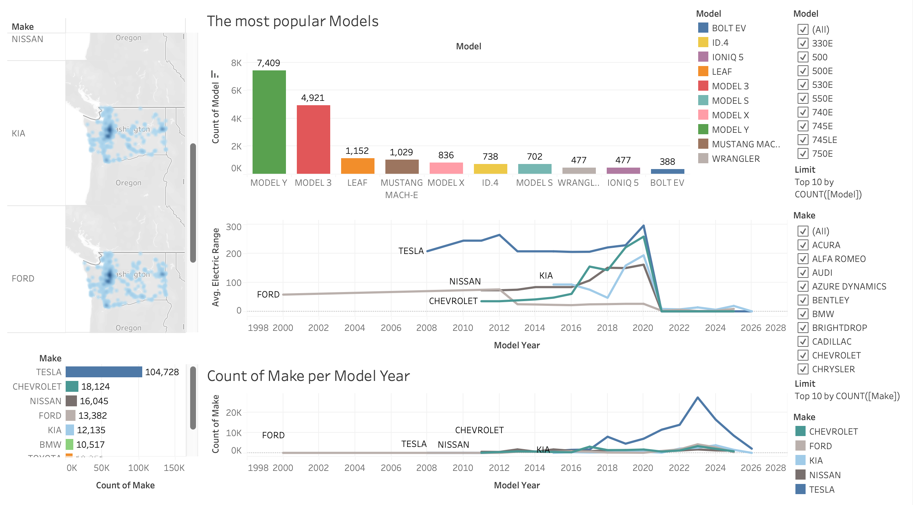
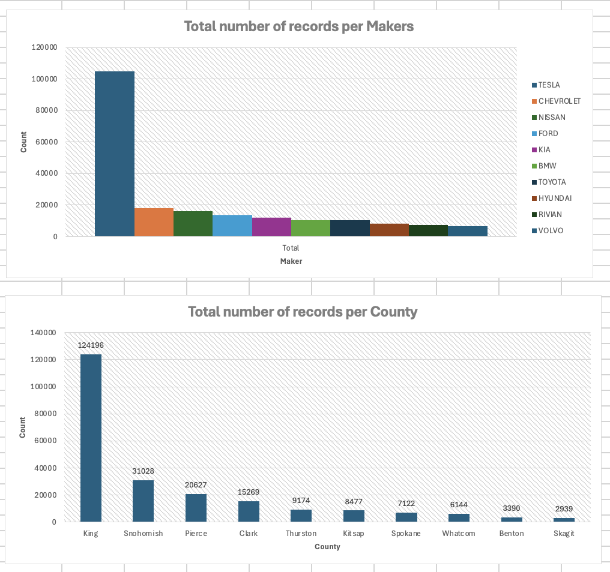
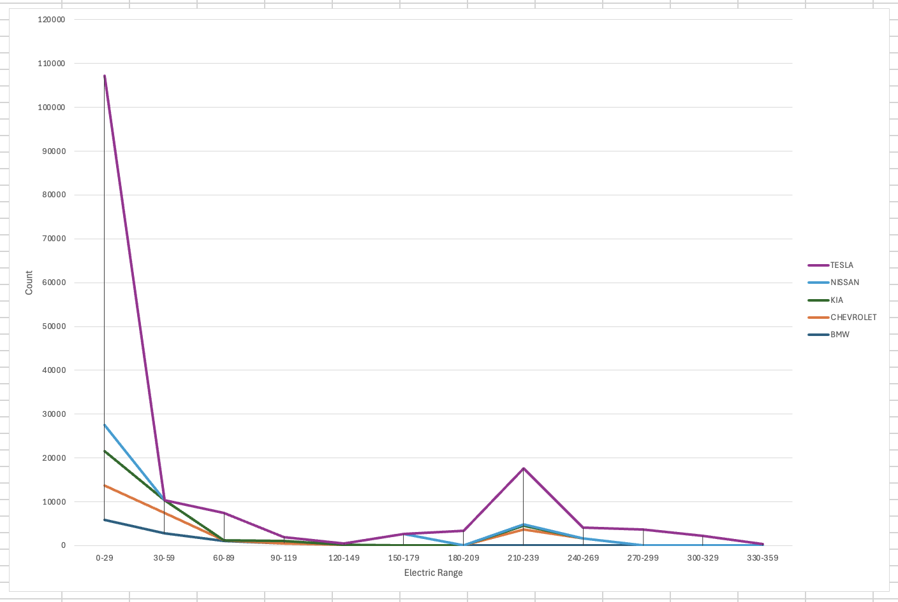
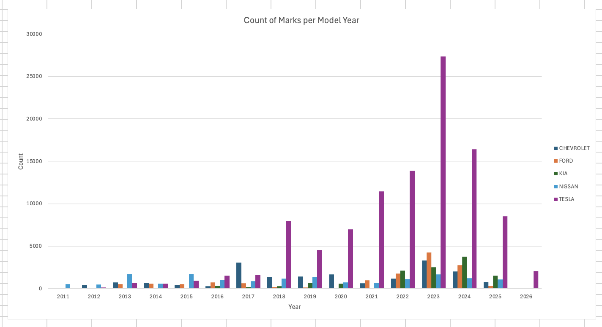
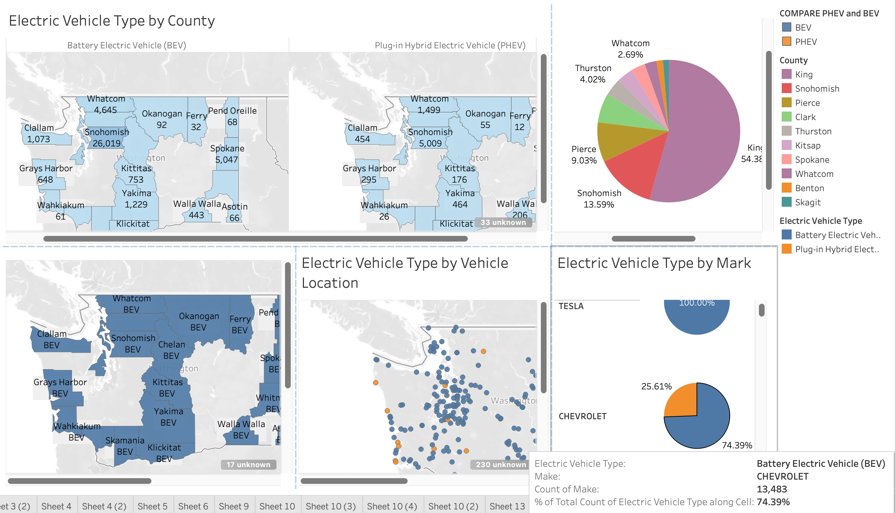

Ось переклад тексту українською мовою згідно з вашими вимогами (назви стовпців та їхні значення залишено без змін):

# Electric Vehicle Population

📍 Вихідний набір даних: [dataset](initial-dataset.csv)

📍 Робоча книга Excel: [workbook](ElectricVehiclePopulationData_workbook.xlsx)

📍 Очищений набір даних: [cleaned dataset](ElectricVehiclePopulationClearData.csv)

📍 Панель моніторингу Tableau: [dashboard](ElectricVehicle.twb)

---

## Зміст

- [1. Розуміння даних](#1-data-understanding)
- [2. Очищення даних](#2-data-cleaning)
- [3. Розвідувальний аналіз даних](#3-exploratory-data-analysis)
- [4. Просторовий аналіз](#4-spatial-analysis)
- [5. Гіпотези та висновки](#5-hypotheses-and-conclusions)
- [6. Додаткові знахідки та цікаві деталі](#6-additional-findings-and-interesting-details)

---

## 1. Розуміння даних

Набір даних Electric Vehicle Population Data містить інформацію про зареєстровані електромобілі в штаті Вашингтон, США. Набір даних представляє реальні записи про реєстрацію транспортних засобів і включає технічну та географічну інформацію.

Кожен рядок представляє один зареєстрований електромобіль.

Набір даних містить інформацію про:

| Стовпець | Опис |
|---|---|
| VIN (1-10) | Перші 10 символів Vehicle Identification Number
County | County, де зареєстровано транспортний засіб
City | City реєстрації
State | Код State
Postal Code | ZIP-код місця реєстрації
Model Year | Рік виробництва транспортного засобу
Make | Виробник транспортного засобу
Model | Модель транспортного засобу
Electric Vehicle Type | Класифікація BEV або PHEV
CAFV Eligibility | Статус відповідності вимогам Clean Alternative Fuel Vehicle
Electric Range | Максимальний запас ходу на електротязі (в милях)
Base MSRP | Рекомендована виробником роздрібна ціна
Legislative District | Номер Legislative District
DOL Vehicle ID | Унікальний ідентифікатор транспортного засобу
Vehicle Location | Географічні координати
Electric Utility | Постачальник електроенергії
2020 Census Tract | Ідентифікатор переписної дільниці

---

## 2. Очищення даних

Перед проведенням аналізу набір даних було перевірено на наявність:

* пропущених значень;
* дубльованих записів;
* некоректних значень;
* несумісних назв;
* аномалій.

---

## 3. Розвідувальний аналіз даних

Ви можете переглянути панель моніторингу онлайн: [Tableau Public Dashboard](https://public.tableau.com/views/ElectricVehicle_17856090722630/Dashboard1?:language=en-US&publish=yes&:sid=&:redirect=auth&:display_count=n&:origin=viz_share_link)









## 4. Просторовий аналіз

Набір даних містить географічну інформацію, що дозволяє аналізувати розподіл електромобілів.

Ви можете переглянути панель моніторингу онлайн: [Tableau Public Dashboard](https://public.tableau.com/shared/3M95M4PH6?:display_count=n&:origin=viz_share_link)



## 5. Гіпотези та висновки

#### Гіпотеза 1

Впровадження електромобілів з часом збільшилося.

Кількість транспортних засобів новіших модельних років значно вища, ніж старіших.

---

#### Гіпотеза 2

Транспортні засоби `BEV` однозначно популярніші за транспортні засоби `PHEV`.

Набір даних показує вищу частку повністю електричних транспортних засобів.

---

#### Гіпотеза 3

TESLA посідає перше місце серед транспортних засобів BEV.

Автомобілі TESLA зареєстровані `104,728` разів, тоді як друге місце належить CHEVROLET з `18,124` автомобілями.

---

#### Гіпотеза 4

Новіші транспортні засоби мають кращий запас ходу на електротязі.

Сучасні моделі електромобілів демонструють значно більший запас ходу порівняно зі старішими транспортними засобами.

---

## 6. Додаткові знахідки та цікаві деталі

Під час аналізу було досліджено кілька нетипових закономірностей.

#### Проблема з найменуванням BrightDrop, деякі транспортні засоби відображаються як:
```
Make = Chevrolet
Model = BrightDrop
```

а інші як:

```
Make = BrightDrop
Model = ZEVO
```

Це було визначено як перехід бренду виробника, а не помилка в даних.

---

#### Нульові значення MSRP, багато транспортних засобів містять:

Base MSRP = 0

Це було визначено як відсутність інформації про ціну, а не як реальна ціна.

---

## Загальний висновок

Аналіз показує, що ринок електромобілів у штаті Вашингтон стрімко розвивається.

Основні висновки:

1. Battery Electric Vehicles домінують на ринку порівняно з Plug-in Hybrid транспортними засобами.
2. Tesla, Nissan та Chevrolet є одними з найвідоміших виробників.
3. Впровадження електромобілів сильно концентрується в міських регіонах.
4. Новіші моделі електромобілів забезпечують значно кращий запас ходу на електротязі, але з певної причини ми спостерігаємо величезний спад у 2011 році.
5. Проблеми з якістю даних здебільшого стосувалися несумісності назв та відсутності значень, а не некоректних записів.